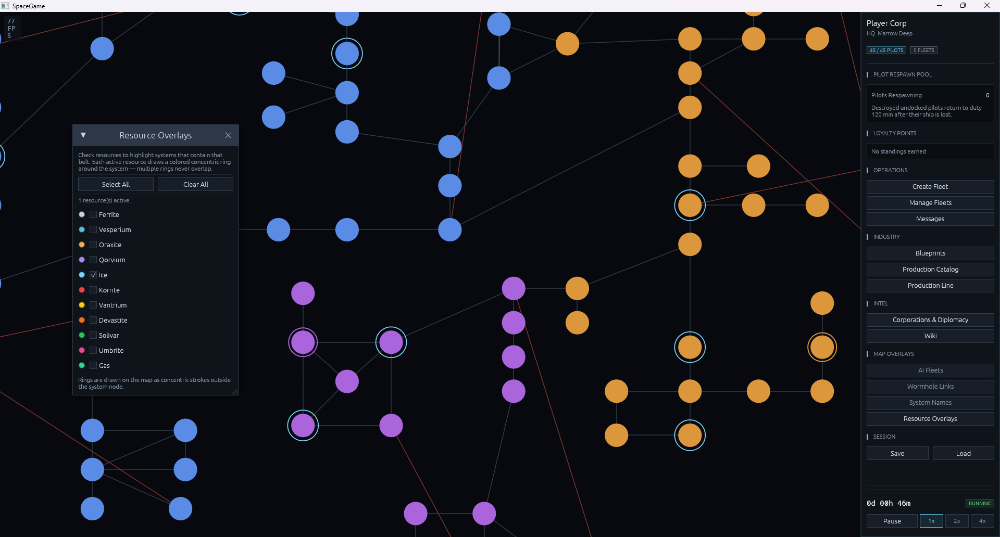
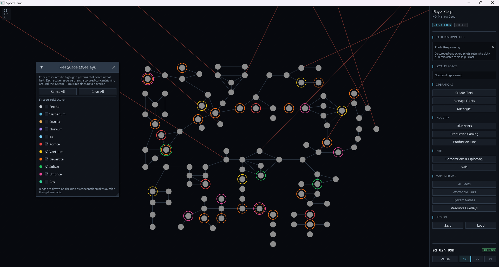
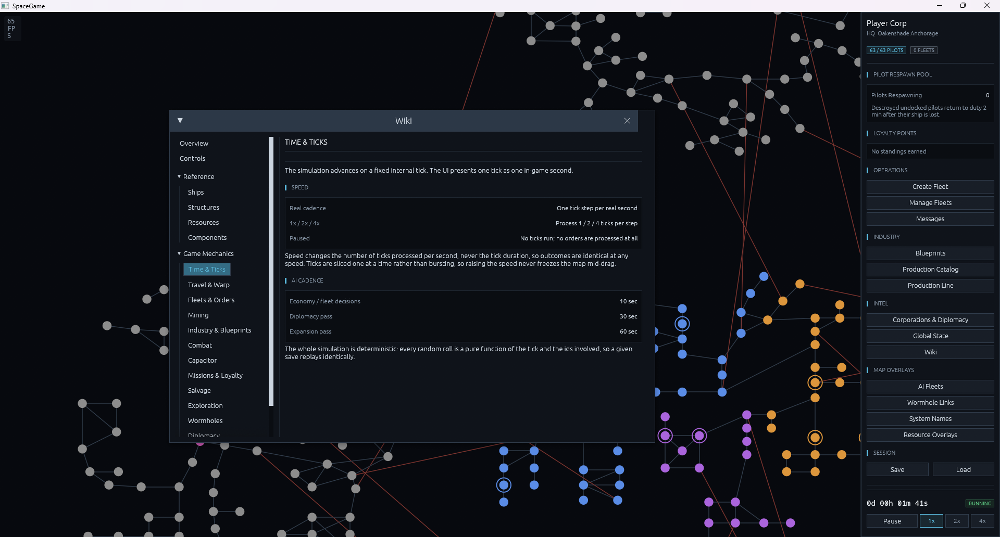
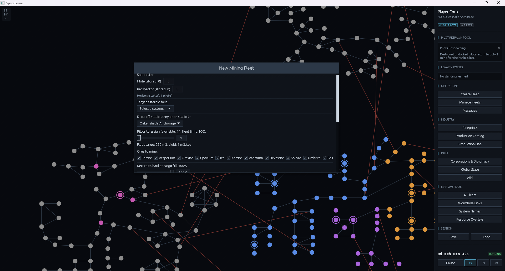

# SpaceGameBeta

Official GitHub for the EVE Online inspired game currently with the placeholder name **"SpaceGame"**.

> **Developer:** Kickdok / Chilldok (u/FortuneOne4926 on Reddit)

SpaceGame is in early Beta and is already in a quite playable state. The focus of this beta is to gather feedback from testers and find bugs.

### About the Game
"SpaceGame" is a sandbox 4X EVE Online inspired game that takes the mechanics from EVE, simplifies them but still tries to keep the EVE feeling.

You take on the role as a leader of a corporation starting in high-sec safe space. Together with 49 programmed bot corporations you must fight for resources and glory.

There is no real winning condition and in this **Beta 1** there are still many future mechanics missing.

### Screenshots

### Installation Notes
*   Since this is a hobby project, **Windows SmartScreen will flag it**. The executable has not been paid to be verified by Microsoft - this is expected, click "More info" -> "Run anyway" if you trust the source.
*   You may need to have **Visual Studio Redistributable / Visual Studio** installed if it is not already on your computer.

### Feedback
This beta is focused on gathering feedback and bug reports - please open an Issue on this repo or message u/FortuneOne4926 on Reddit.

---
*Placeholder name "SpaceGame" - final name TBA*
